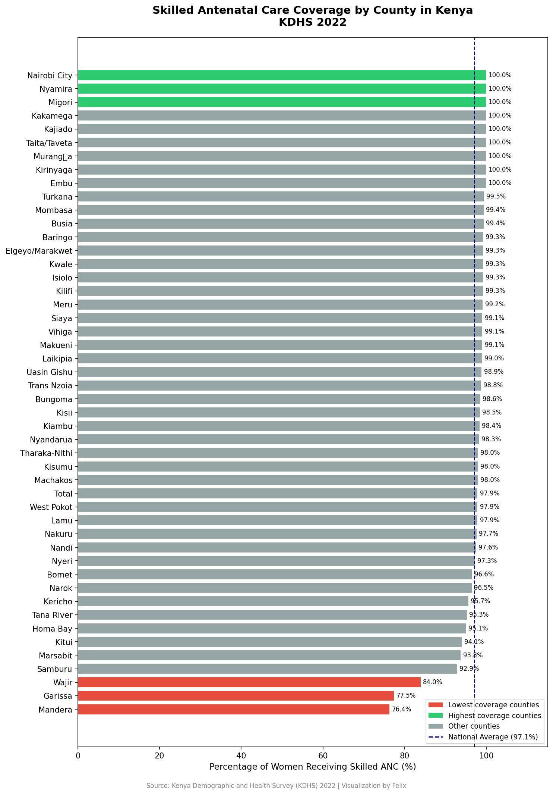
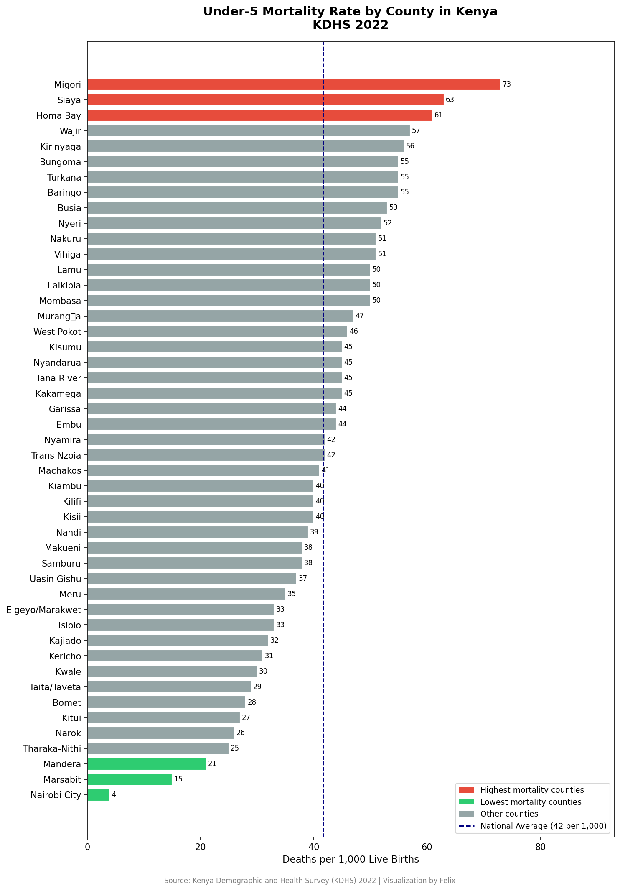

# Kenya Maternal & Child Health Analysis
## A County-Level Data Series | KDHS 2022

This repository contains a two-part data analysis project examining 
maternal and child health indicators across all 47 Kenyan counties 
using data from the Kenya Demographic and Health Survey (KDHS) 2022.

## Project 1 — Skilled Antenatal Care Coverage

### Key Finding
Kenya's national skilled ANC coverage average is 97.1%, but this figure 
masks a serious regional divide.

- 🔴 **Lowest coverage:** Mandera, Garissa and Wajir
- 🟢 **Highest coverage:** Nairobi City, Nyamira and Migori
- ⚠️ Counties in North Eastern Kenya fall significantly below the 
  national average, indicating that geography and infrastructure 
  remain critical barriers for women accessing maternal care.

### Visualization

## Project 2 — Under-5 Mortality Rate

### Key Finding
Kenya's national under-5 mortality rate stands at 42 deaths per 
1,000 live births. However, the data reveals a surprising pattern 
that challenges assumptions about poverty and child survival.

- 🔴 **Highest mortality:** Migori, Siaya and Homa Bay
- 🟢 **Lowest mortality:** Nairobi City, Mandera and Marsabit
- ⚠️ The Nyanza region shows elevated mortality rates likely driven 
  by malaria and HIV burden — despite having better infrastructure 
  than North Eastern counties.

### Key Insight
Comparing both projects reveals a striking analytical tension —
counties like Mandera have **low ANC coverage** but **relatively low 
under-5 mortality**, while counties like Migori have **decent ANC 
coverage** but **high child mortality**. This suggests that child 
survival in Kenya is shaped not just by poverty or remoteness, 
but by disease ecology and healthcare quality.

### Visualization

## Tools Used
- Excel
- Python
- Pandas
- Matplotlib
- Google Colab

## Data Source
- Kenya Demographic and Health Survey (KDHS) 2022
- Published by Kenya National Bureau of Statistics (KNBS)
- Table 9.1C — Antenatal care by county
- Table 8.1 — Under-5 mortality by county

## Author
**Felix Beru**
Data Analyst | Nairobi, Kenya

📊 Passionate about using data to improve health outcomes in Kenya

