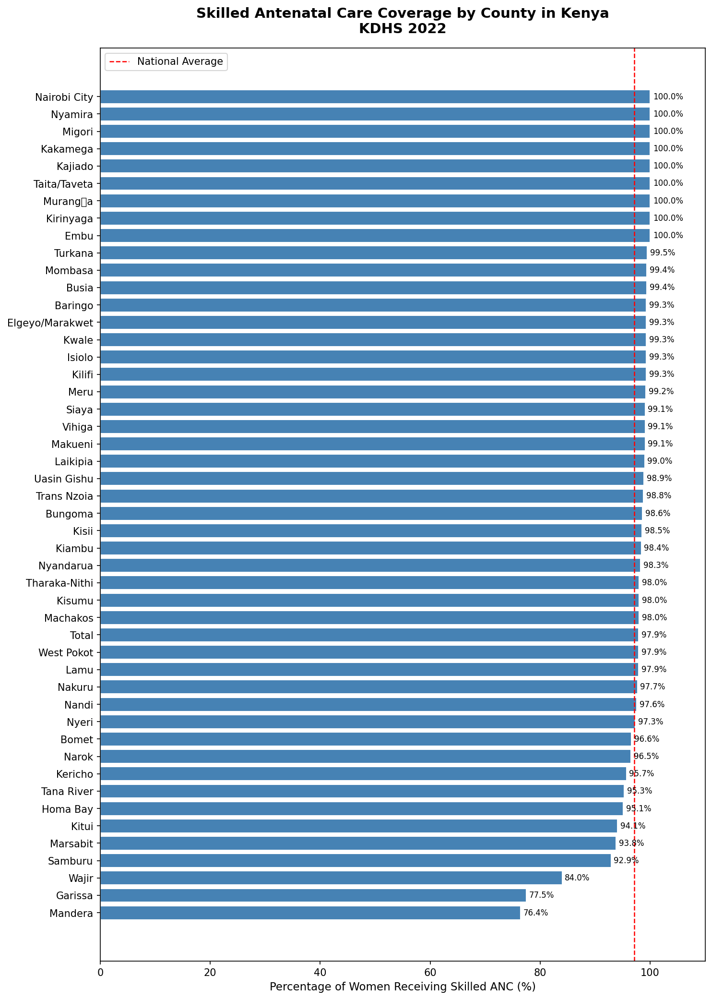

# Kenya Maternal Health - Skilled ANC Coverage Analysis

## Overview
This project analyzes skilled antenatal care (ANC) coverage across all 47 counties 
in Kenya using data from the Kenya Demographic and Health Survey (KDHS) 2022.

The goal is to identify regional disparities in maternal healthcare access 
and highlight counties that need targeted interventions.

## Key Finding
Despite a national skilled ANC coverage average of 97.1%, there is a sharp 
regional divide across Kenyan counties.

- 🔴 **Lowest coverage:** Mandera, Garissa and Wajir
- 🟢 **Highest coverage:** Nairobi City, Nyamira and Migori
- ⚠️ The national average masks a serious equity gap in maternal health access 
  in North Eastern Kenya

Counties in the North Eastern region show significantly lower coverage, 
indicating that geography, infrastructure and access remain critical barriers 
for women in these areas.

## Visualizations

### Initial Exploration

### Insight Chart — Regional Disparities Highlighted

## Data Source
- **Kenya Demographic and Health Survey (KDHS) 2022**
- Published by Kenya National Bureau of Statistics (KNBS)
- Table 9.1C — Antenatal care by county

## Tools Used
- Excel
- Python
- Pandas
- Matplotlib
- Google Colab

## Author
**Felix**
Data Analyst | Nairobi, Kenya
