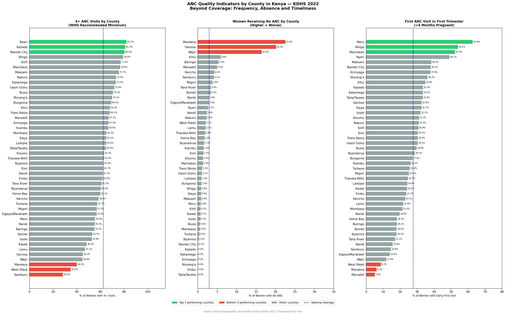
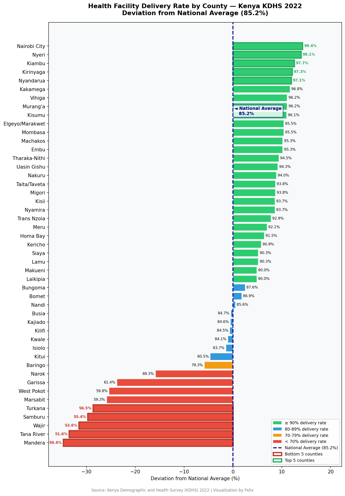

##  Interactive Dashboard
Explore all four projects in one interactive dashboard:
[ https://kenya-maternal-health-anc-analysis-oasrbxen82vgwacmq4vbny.streamlit.app/)

Built with Python and Plotly — hover over any bar for details,
zoom into specific counties, and explore the full dataset interactively.
# Kenya Maternal & Child Health Analysis
## A County-Level Data Series | KDHS 2022

This repository contains a two-part data analysis project examining 
maternal and child health indicators across all 47 Kenyan counties 
using data from the Kenya Demographic and Health Survey (KDHS) 2022.

## Project 1 — Skilled Antenatal Care Coverage

## Key Finding
Kenya's national skilled ANC coverage average is 97.1%, but this figure 
masks a serious regional divide.

- 🔴 **Lowest coverage:** Mandera, Garissa and Wajir.
- 🟢 **Highest coverage:** Nairobi City, Nyamira and Migori.
- ⚠️ Counties in North Eastern Kenya fall significantly below the 
  national average, indicating that geography and infrastructure 
  remain critical barriers for women accessing maternal care.

## Visualization

## Project 2 — Under-5 Mortality Rate

### Key Finding
Kenya's national under-5 mortality rate stands at 42 deaths per 
1,000 live births. However, the data reveals a surprising pattern 
that challenges assumptions about poverty and child survival.

- 🔴 **Highest mortality:** Migori, Siaya and Homa Bay
- 🟢 **Lowest mortality:** Nairobi City, Mandera and Marsabit
- ⚠️ The Nyanza region shows elevated mortality rates likely driven 
  by malaria and HIV burden  despite having better infrastructure 
  than North Eastern counties.

# Key Insight
Comparing both projects reveals a striking analytical tension
counties like Mandera have **low ANC coverage** but **relatively low 
under-5 mortality**, while counties like Migori have **decent ANC 
coverage** but **high child mortality**. This suggests that child 
survival in Kenya is shaped not just by poverty or remoteness, 
but by disease ecology and healthcare quality.

# Visualization
[Under-5 Mortality by County](kenya_under5_mortality.png)

# Tools Used
- Excel
- Python
- Pandas
- Matplotlib
- Google Colab

# Data Source
- Kenya Demographic and Health Survey (KDHS) 2022
- Published by Kenya National Bureau of Statistics (KNBS)
- Table 9.1C — Antenatal care by county
- Table 8.1 — Under-5 mortality by county

# Project 3 — ANC Quality: Beyond the 97% Coverage Figure
# Background
Following engagement on the first analysis, a health professional challenged 
the 97.1% ANC coverage figure noting that timeliness and number of contacts 
tell a more honest story. This project responds to that feedback with data.

# Key Finding
When you look beyond attendance numbers, a deeper quality gap emerges across 
Kenyan counties across three indicators:

- **National 4+ visits coverage:** Only 62.3% of women complete the WHO 
  recommended minimum of 4 ANC visits
- **First trimester initiation:** Only 27.6% of women begin ANC in the 
  first trimester nationally
-  **No ANC at all:** Mandera, Garissa and Wajir have the highest proportions 
  of women receiving zero antenatal care

# Pattern Found
Mandera appears as a consistently underperforming county across all three 
quality indicators low 4+ visits, highest no-ANC rate, and fewest first 
trimester visits. This points to a systemic access barrier beyond simple 
coverage statistics.

Counties like Meru, Vihiga and Machakos show strong early initiation despite 
not topping overall coverage charts  suggesting quality of engagement matters 
as much as attendance.

# Insight
> *Kenya's maternal health challenge is no longer just about getting women to 
attend ANC  it's about getting them there early enough and often enough to 
make a difference.*

# Visualization

# Data Source
- Kenya Demographic and Health Survey (KDHS) 2022
- Table 9.2C  Number of ANC visits and timing of first visit by county

  ### Final Visualization — Heatmap
[ANC Quality Heatmap](kenya_anc_heatmap.png)

## Project 4 — Health Facility Delivery Rate by County

### Key Finding
Kenya's national health facility delivery rate stands at 85.2% meaning 
roughly 1 in 7 women still delivers outside a health facility. But that 
national figure masks a sharp divide.

- 🔴 **16 out of 47 counties** fall below the national average
- 🔴 **Largest gaps:** Mandera, Tana River and Wajir
- 🟢 **Highest rates:** Nairobi City (99.4%), Nyeri (99.1%) and Kiambu (97.7%)
- ⚠️ Tana River emerges as a new concern in this project remoteness 
  and infrastructure gaps are driving women to deliver at home without 
  skilled assistance

### Series Pattern
Mandera has now appeared at the bottom across all four projects in this 
series ANC coverage, ANC quality, under-5 mortality and facility delivery. 
This points to a systemic crisis rather than isolated challenges.

### Visualization

### Data Source
- Kenya Demographic and Health Survey (KDHS) 2022
- Table 9.4 Place of delivery by county

## Series Conclusion — The Geography of Maternal Health Inequality in Kenya

This four-part analysis set out to understand maternal and child health 
outcomes across Kenya's 47 counties using KDHS 2022 data. The findings 
reveal a consistent and troubling pattern.

### The Recurring Crisis Counties
Across all four projects, the same counties appear repeatedly at the bottom:

| County | ANC Coverage | ANC Quality | Under-5 Mortality | Facility Delivery |
|---|---|---|---|---|
| Mandera | 🔴 Bottom 3 | 🔴 Bottom 3 | 🔴 High | 🔴 Lowest |
| Wajir | 🔴 Bottom 3 | 🔴 Bottom 3 | 🔴 High | 🔴 Bottom 3 |
| Garissa | 🔴 Bottom 3 | 🔴 Bottom 3 | 🔴 High | 🔴 Bottom 3 |

These are not isolated data points. This is a systemic pattern of 
maternal health deprivation concentrated in North Eastern Kenya.

### The Hidden Story Behind National Averages
- Kenya's **97.1% ANC coverage** hides the fact that only **62.3%** of 
  women complete the WHO recommended 4+ visits.
- Kenya's **85.2% facility delivery rate** means roughly **1 in 7 women** 
  still delivers outside a health facility.
- Kenya's **42 under-5 deaths per 1,000** national average masks rates 
  nearly double that in Nyanza region counties.

### Key Insight

> **The challenge facing Kenya's maternal health system is not coverage
it is equity. The data consistently shows that where you are born in Kenya 
determines whether your mother had skilled care, whether she delivered 
safely, and whether you survived your first five years of life.**

### Recommendations for Policymakers and Health Organizations
1. **Targeted investment** in Mandera, Wajir and Garissa across all 
   maternal health indicators.
2. **Quality over quantity** ANC attendance numbers are misleading 
   without measuring timeliness and frequency.
3. **Tana River** requires urgent attention as an emerging concern 
   in facility delivery rates.
4. **Nyanza region** needs a disease-specific intervention strategy 
   addressing malaria and HIV burden driving under-5 mortality.

## About This Project
This analysis was built entirely using:
- Python, Pandas and Matplotlib
- Google Colab
- Kenya Demographic and Health Survey (KDHS) 2022
- Data sourced from Kenya National Bureau of Statistics (KNBS)

## Author
**Felix Beru** | Data Analyst | Nairobi, Kenya
Passionate about using data to drive health equity in Kenya 🇰🇪

[www.linkedin.com/in/felix-beru-04b905280]
